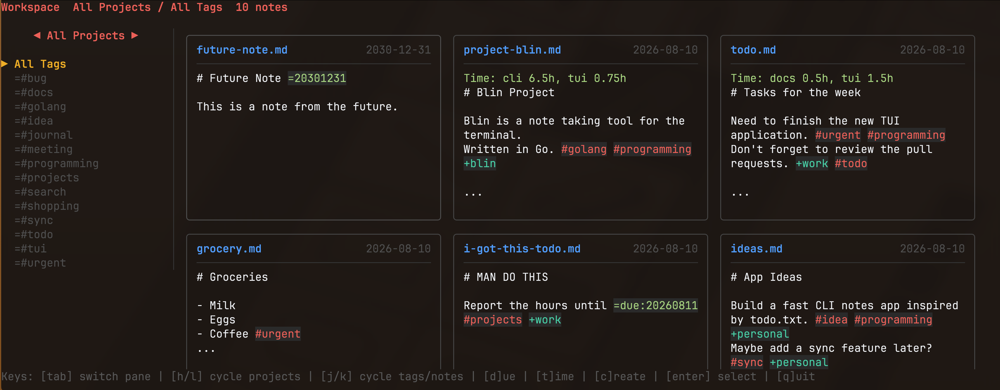

# blin

blin is a terminal notes application inspired by [Blinko](https://github.com/blinko-space/blinko) and [todo.txt](http://todotxt.org/). Notes are regular Markdown files. Inline metadata makes notes searchable and sortable without a database.



## Note syntax

Use metadata anywhere in a Markdown file:

```md
# Weekly planning =20260808

Finish the terminal interface. =#urgent =#programming =+work
Review the release checklist. =#todo =+work
```

| Syntax | Meaning | Example |
| --- | --- | --- |
| `=#tag` | Tag | `=#programming` |
| `=+project` | Project | `=+work` |
| `=YYYYMMDD` | Note date | `=20260808` |
| `=due:YYYYMMDD` | Due date | `=due:20260815` |
| `=tt:YYYYMMDD:(ID:hours)` | Time entry | `=tt:20260810:(task-42:2.5h)` |
| `=blin:filename` | File to Reference | `=blin:todo.md` |

Dates may contain `/` or `-`; blin removes those separators before parsing. Notes sort newest first. A valid note date takes precedence over the file modification time. Due dates are kept separately and sort earliest first.

Time Tracking shows total hours for each ID.

## Build

```sh
go build -o bin/blin ./cmd/cli
go build -o bin/blin-tui ./cmd/tui
```

## TUI

Start the TUI from the directory containing your Markdown notes:

```sh
go run ../cmd/tui
```

The left sidebar selects a project and its available tags. The right pane shows the matching notes.

| Key | Action |
| --- | --- |
| `tab` | Switch between sidebar and notes |
| `h` / `l` | Change project in the sidebar, or move left/right between notes |
| `j` / `k` | Change tag in the sidebar, or move down/up between notes |
| `enter` | Focus notes from the sidebar, or open the selected note |
| `c` | Create a note |
| `e` | Edit the open note in the built-in editor |
| `E` | Edit the open note with `$EDITOR` |
| `esc` | Return to the notes view |
| `q` | Quit |

The built-in create and edit forms save with `ctrl+s`. Spaces in note names are converted to hyphens and `.md` is added automatically.

Select `Due` in the project menu, or press `d`, to view due notes ordered by their nearest due date.
Select `Time Tracking`, or press `t`, to view notes with time entries.

## CLI

Run the CLI from a notes directory, or pass `-folder`:

```sh
go run ../cmd/cli
go run ../cmd/cli -folder ./examples
```

The default command prints all notes with filename headers. `-ls` prints just the selected Markdown contents. Both color tags, projects, and dates and accept the same filters.

```sh
# Print all notes
go run ../cmd/cli

# Print raw note contents for one project and tag
go run ../cmd/cli -ls -filter-project =+work -filter-tag '=#urgent'

# List tags available for a project
go run ../cmd/cli -ls-tags -filter-project =+work

# List projects
go run ../cmd/cli -ls-projects

# Print due notes, soonest first
go run ../cmd/cli -due

# Print time entries and totals
go run ../cmd/cli -time-tracked

# Paginate note output
go run ../cmd/cli -per-page 5 -page 2

# Print one note
go run ../cmd/cli -view weekly-planning

# Create a note and open it in $EDITOR
go run ../cmd/cli -create 'weekly planning' -content '# Weekly Planning'
```

> The TUI was completely generated with AI assistance. Most of the CLI, along with the lexer and overall design, was written by a human and validated with AI assistance.
